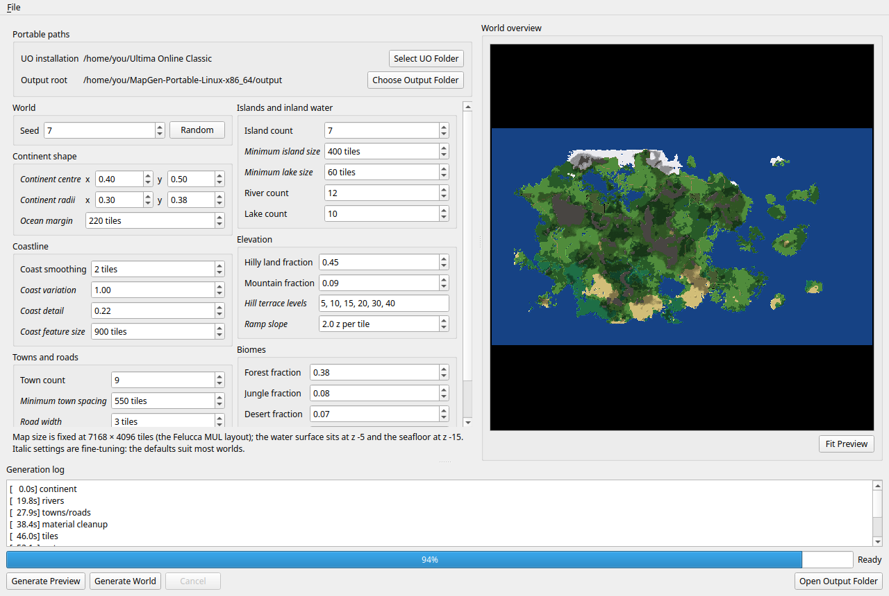
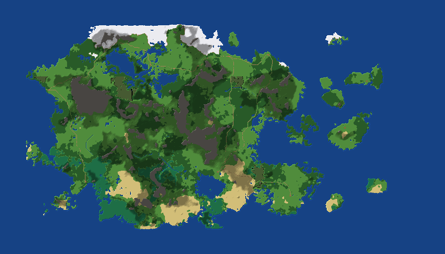

# UOCloneProject-ProcMapGen

The UO Clone Project's procedural map generator. MapGen generates complete,
playable Ultima Online worlds from a seed and a page of settings. It writes
the three classic map files (`map0.mul`, `staidx0.mul`, `statics0.mul`) in
the Felucca layout, with coastlines, rivers, lakes, terraced hills, mountains,
biomes, towns, roads, bridges and vegetation, following rules measured from
the original Felucca map so that the result looks and plays like Britannia
rather than like noise.

It is a desktop application for Linux and Windows. The release folders are
self-contained: no Python, no packages to install.

**Every world is reproducible.** The same seed and settings produce exactly
the same three files, byte for byte, on any machine. A world is therefore
fully described by its seed and its `config.json`: share those and anyone can
regenerate the identical world, whether to pass on a good one or to report a
broken one (see "Reproducibility" below).





## Requirements

- **Linux:** 64-bit, glibc 2.36 or newer (Debian 12, Ubuntu 24.04, Fedora 38
  and later, or anything comparable).
- **Windows:** 64-bit Windows 10 or newer.
- **A legally obtained Ultima Online client installation:** the **Classic
  Client** from [uo.com/client-download](https://uo.com/client-download/).
  MapGen reads one file from it, `tiledata.mul`, to know the flags and sizes
  of every tile. Nothing from the client is bundled, copied or written; the
  application asks for the folder on first use. The Windows client's default
  folder is `C:\Program Files (x86)\Electronic Arts\Ultima Online Classic`.
- About 3 GB of free memory while generating, and 150 MB of disk per world.
- Generating a world takes from about a minute on a fast many-core machine to
  several minutes on a laptop (see "Performance" below). A preview takes a
  fraction of that.

## Download and run

1. Download the archive for your system from this repository's **Releases**
   page, `MapGen-Portable-Linux-x86_64.tar.gz` or
   `MapGen-Portable-Windows-x86_64.zip`, and unpack it anywhere. Keep the
   unpacked folder together: the executable needs the `_internal` folder
   beside it. (If you are here for the source instead, see "Building from
   source" below.)
2. Run `MapGen` (Linux) or `MapGen.exe` (Windows).
   - Linux: if the file is not executable after unpacking, run
     `chmod +x MapGen` once. A `MapGen.desktop` launcher is included.
   - Windows: the executable is not code-signed, so SmartScreen shows
     "Windows protected your PC" the first time. Choose **More info**, then
     **Run anyway**.

Everything the application saves - your settings and the worlds it
generates - lands inside its own folder, so you can move or copy the whole
folder to another machine and keep them.

## First run

The **Portable paths** box at the top left holds the two folders MapGen
needs:

- **UO installation:** click **Select UO Folder** and choose the folder that
  contains `tiledata.mul` (if you have no client installed, get the Classic
  Client from [uo.com/client-download](https://uo.com/client-download/)).
  MapGen checks that the file is there before it accepts the folder. You can
  generate previews without it; a world needs it.
- **Output root:** where generated worlds are written. The default is an
  `output` folder inside the release folder; **Choose Output Folder** changes
  it.

Both are remembered in `portable-settings.json` beside the executable,
together with the last settings you used.

## Settings

All world settings sit on one page, grouped by what they shape:

| Group | What it controls |
| --- | --- |
| **World** | The seed. **Random** picks a new one. |
| **Continent shape** | Where the main continent sits and how big its base oval is; the ocean margin along the map edge. |
| **Coastline** | How rounded or ragged the coast is, and how large its bays and headlands are. |
| **Islands and inland water** | Extra islands, the smallest island and lake kept, and how many rivers and extra lakes to attempt. |
| **Elevation** | How much of the land is hilly, how much of that is impassable mountain, the terrace heights and the ramp slope. |
| **Biomes** | The share of dry land given to forest, jungle, desert, snow and swamp; grass is what remains. |
| **Towns and roads** | How many towns to place, how far apart, and how wide the roads are. |

Hover over any setting - its name or its box - for a plain-language
description of what it does, the range it accepts and its default. Settings
drawn in *italics* are fine-tuning; the defaults suit most worlds. A value
outside its range is refused with a message naming the setting.

Two things are fixed and are therefore not settings: the map size, which is
the Felucca layout of 7168 x 4096 tiles, and the water levels (the surface at
z -5 over a seafloor at z -15), which are part of the measured shoreline
rules.

**Presets.** **File > Save preset** and **File > Load preset** store and
restore a page of settings as a JSON file, and **File > Reset defaults**
returns to the defaults. Two presets ship in `_internal/presets/`
(`default.json`, and a second world worth trying). Presets saved by earlier
versions of MapGen still load.

Counts are attempts, not guarantees: an island that lands too close to the
continent merges into it, a river with no route to the sea is skipped, and a
town with no valid site is not placed. The log reports what was actually
built.

## Generating

**Generate Preview** runs only the first stages - continent, terrain, biomes -
and shows the result in the **World overview** pane in about a quarter of the
time of a full world. It needs no client files. Use it to find a seed and a
shape you like; rivers, roads, shoreline detail and vegetation only appear in
the full world, so the final overview differs in those details. Previews are
cached per seed and settings under `<output root>/.preview`, so asking for
the same preview again is instant.

**Generate World** runs every stage and writes the map files. Progress shows
in the bar and the **Generation log** below it, one line per stage with the
elapsed time; a full run's log ends with the world's metrics.

**Cancel** stops the running job. A cancelled world is kept for diagnosis in
a folder ending in `.cancelled`, never under a normal name, so a
normal-looking output folder is always a complete world.

**Fit Preview** refits the overview to the pane; drag to pan and scroll to
zoom. **Open Output Folder** opens the latest world's folder (or the output
root) in your file manager.

### What a world folder contains

Completed worlds are written to `<output root>/seed_<seed>_<date-time>/`:

| File | What it is |
| --- | --- |
| `map0.mul`, `staidx0.mul`, `statics0.mul` | The playable world: land tiles and heights, and the statics index and records. These three are what you copy into a client or server. |
| `overview.png` | The biome and elevation map, one pixel per 8 tiles. |
| `config.json` | The exact settings used. Load it as a preset to regenerate the world. |
| `meta.json` | Town sites, the road links between them, and the river lengths. |
| `metrics.json` | Measurements of the world (land and water counts, slope statistics, shoreline coverage, walkability) next to Felucca's values. |
| `gen_state.npz` | The generator's masks (material, height, water, roads, rock, towns) for tools that inspect the world. |
| `generation.log` | The full log of the run. |

## Using the world

The three `.mul` files are the classic map format that every Ultima Online
server emulator (RunUO, ServUO and their descendants), the ClassicUO client
and the CentrED map editor read. They replace **Felucca (map 0)**:

- **In CentrED**, the generated files load as they are: point a server
  profile's map files at the world folder (or copy the three files into the
  profile's map folder) to view and edit the world with the client's art.
- **On a server**, copy the three files over the server's `map0.mul`,
  `staidx0.mul` and `statics0.mul` (ServUO and RunUO read them from the
  client folder they are configured with).
- **In a client**, the map needs one conversion. The modern classic client
  reads its land data from `map0LegacyMUL.uop`, not from `map0.mul`, so
  convert the generated `map0.mul` to `map0LegacyMUL.uop` with
  [UOFiddler](https://github.com/polserver/UOFiddler)'s **UOP Packer** tool
  and put the result in the client folder in place of the original;
  `staidx0.mul` and `statics0.mul` are used as they are. (ClassicUO also
  reads a plain `map0.mul` when no `.uop` is present.) Work on a copy of the
  client folder, never the original.

The generated world uses the standard land and static ids, so it looks right
with the standard client art. It does not include buildings, dungeons, NPC
spawns or anything a server adds on top; it is the terrain.

Back up anything you replace. The generated files are the same size as the
originals (`map0.mul` is 90 MB).

## Reproducibility

The same seed with the same settings always produces exactly the same three
files, byte for byte, whether generated on Linux or Windows, with any number
of threads, from a release or from source. This is a deliberate property of
the generator (every random choice descends from the one seed, in a fixed
order), and it is checked on every change: the reference is seed 7 with the
default settings, whose file hashes are in `VERIFICATION.md`.

In practice this means a world is its settings. Every world folder holds its
`config.json`; load it as a preset (**File > Load preset**) to regenerate
that world, or send it to someone else and they get the identical world.
Found a striking world? Share the seed. Found a broken one, a bridge to
nowhere or an odd coastline? Report the seed and settings and anyone can
generate exactly the same map and look at the same tile.

### Performance

The generator uses every CPU core by default, and its speed is dominated by
sweeps over full-map arrays (each is 117 MB), so memory bandwidth matters as
much as core count. Expect roughly 75 seconds for a full world on a 16-core
machine with fast memory and a few minutes on a typical desktop or laptop;
the preview takes about a quarter of that. The output never depends on the
machine or the thread count. If a run is slower than expected:

- Set the environment variable `MAPGEN_THREADS` to your number of physical
  cores (for example `MAPGEN_THREADS=8`); hyper-threads rarely help.
- Exclude the output folder from real-time antivirus scanning; the generator
  writes several large files.
- Close other memory-hungry applications; a world needs about 3 GB.

## Building from source

Releases are built with PyInstaller from `mapgen_portable.spec`; the scripts
and the details are in `BUILDING.md`.

- **Linux release:** `./build_linux.sh` (needs Podman; builds against Debian
  12 so the result runs on older distributions).
- **Windows release, on Windows:** `powershell -ExecutionPolicy Bypass -File .\build_windows.ps1`
  (needs Python 3.12 from python.org with the py launcher).
- **Windows release, from Linux:** `./build_windows_from_linux.sh` (needs
  Wine 10 or newer).

To run from source you need Python 3.11 or newer and the pinned dependencies
in `pyproject.toml` (NumPy, SciPy, Pillow, PySide6, edt):

```bash
python3 -m pip install numpy==2.4.6 scipy==1.18.0 Pillow==12.3.0 PySide6==6.11.1 edt==3.1.2
./run_development.sh                                  # the GUI (Windows: run_development.cmd)
python3 -m gen.pipeline --seed 7 --out /tmp/seed7     # the generator alone, no GUI
python3 -m unittest discover -s tests                 # the tests (40, under a second)
```

Any change to the generator must reproduce the seed-7 hashes in
`VERIFICATION.md`; `CONTRIBUTING.md` explains that contract and the rest of
what a change needs.

## How it works

The generator (`gen/`) is one pipeline of stages over full-resolution arrays:
a continent from warped noise; rivers routed downhill to the sea; towns
joined by a road network with straightened water crossings; every tile given
a land id through Britannia's own transition kits; the shoreline built the
way the original map builds it (a trench of sunk tiles under water statics,
with the measured bank heights and corner pieces); plank bridges over the
crossings; vegetation from a catalogue of the props Felucca uses on each kind
of land; then the map files and a metrics report. The GUI (`gui/`) runs the
generator in a separate process and only shows its log.

`HOW-IT-WORKS.md` walks through the stages, the process model and the
multithreading; `docs/` holds the measurements of Felucca that every rule is
tuned against (`docs/README.md` is the index); and each module's docstring
defines the terms it uses.

## Credits

MapGen stands on the open-source Ultima Online community's work. The file
formats, the client's drawing rules and its walking rule were learned from:

- [ClassicUO](https://github.com/ClassicUO/ClassicUO), the open-source
  client: its art, texmap and hue loaders, the walking rule and the land
  normals.
- [CentrED#](https://github.com/kaczy93/centredsharp), the map editor: the
  rendering geometry the project's software renderer reproduces, and the
  editor the worlds are checked in.
- [RunUO](https://github.com/runuo/runuo) and
  [ServUO](https://github.com/ServUO/ServUO), the server emulators: the
  server-side movement rule and tile height calculations.
- [UOFiddler](https://github.com/polserver/UOFiddler): reference for the
  MUL and UOP layouts.

And on these libraries: [NumPy](https://numpy.org/), [SciPy](https://scipy.org/),
[Pillow](https://python-pillow.github.io/),
[Qt for Python (PySide6)](https://www.qt.io/qt-for-python),
[edt](https://github.com/seung-lab/euclidean-distance-transform-3d) for
exact multithreaded distance transforms, and
[PyInstaller](https://pyinstaller.org/) for the release builds.

Ultima Online is a trademark of Electronic Arts. This project is not
affiliated with or endorsed by Electronic Arts or Broadsword; it does not
distribute any of their files.

## License

MapGen is free software under the
[GNU General Public License, version 3.0](LICENSE). The libraries in the
release folders keep their own licenses, listed in
`THIRD-PARTY-NOTICES.md`.
